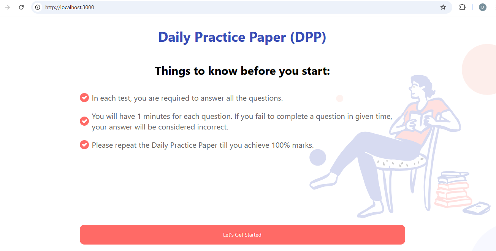
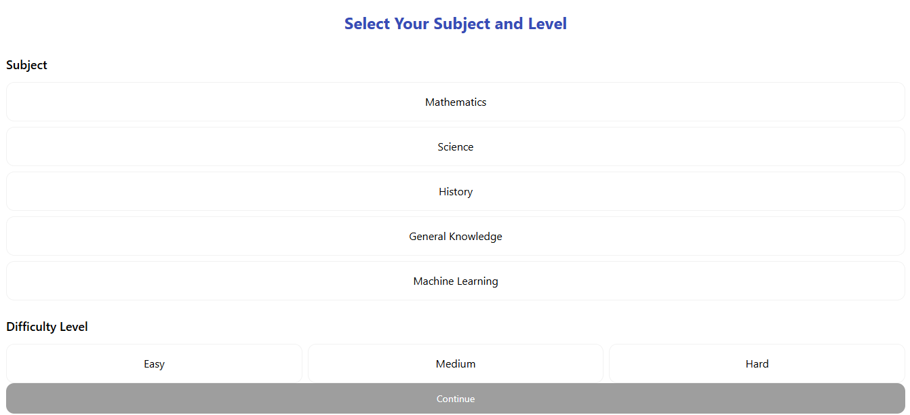
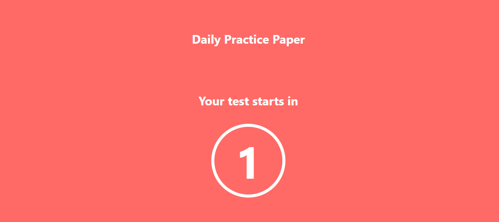
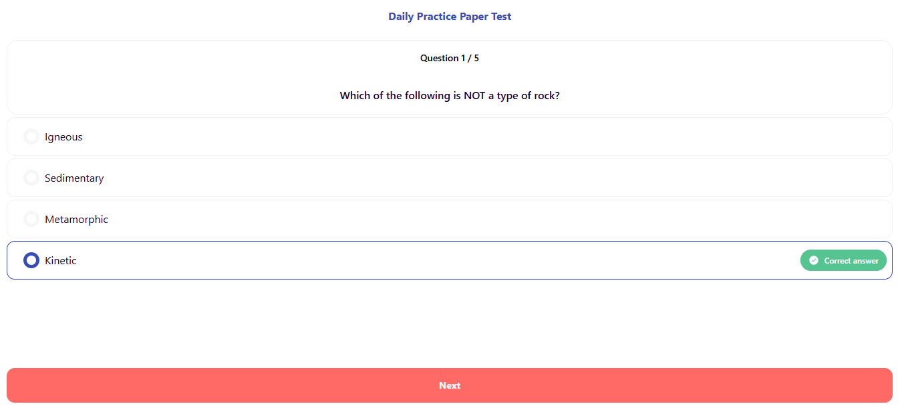
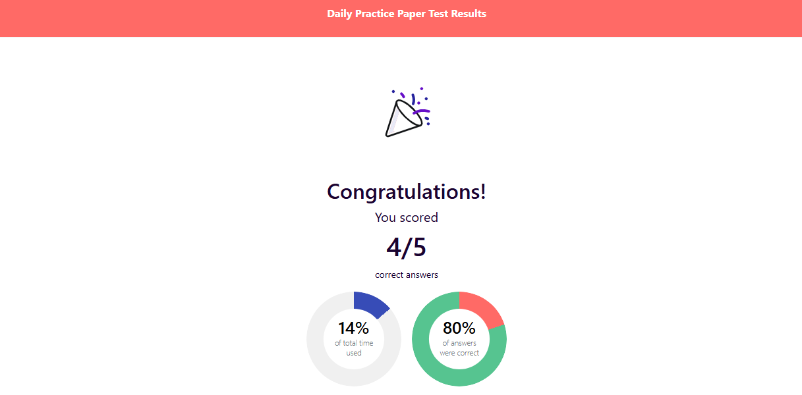

# 🎯 AI-Powered Quiz App  

An **AI-driven quiz platform** that generates dynamic multiple-choice questions using **Google Gemini AI**, ensuring engaging and adaptive learning experiences! 🌟  

---

## 📌 **Features**
✅ **AI-Generated Questions** – Dynamic quizzes based on selected topics & difficulty.  
✅ **Secure Authentication** – User login for personalized quiz experiences.  
✅ **Real-time Timer** – Answer under time constraints for added challenge.  
✅ **Performance Analytics** – See correct/wrong answers and time spent per question.  
✅ **Fully Responsive UI** – Works seamlessly on desktop & mobile devices.  

---

## ⚡ **Tech Stack**
### 🔹 **Frontend (React + Next.js)**
- **Next.js 13+** – Fast rendering & API handling  
- **Tailwind CSS** – Beautiful, mobile-friendly UI  
- **Framer Motion** – Smooth animations  
- **Axios** – API handling  
- **Lottie Animations** – Interactive UI elements  

### 🔹 **Backend (FastAPI)**
- **FastAPI** – High-performance Python backend  
- **MongoDB (via Motor)** – NoSQL database for user & quiz data  
- **Google Gemini API** – AI-powered question generation  
- **JWT Authentication** – Secure user sessions  

---

## 🚀 **Getting Started**
### ** 1️. Clone the Repository**
git clone https://github.com/yourusername/your-repo.git

cd your-repo

### ** 2. Create & activate virtual environment **
python -m venv venv

source venv/bin/activate   # macOS/Linux

venv\Scripts\activate      # Windows

#### Install backend dependencies
pip install -r requirements.txt

### ** 3. Setup Environment Variables (.env) **
Create a .env file inside the backend 
directory:

GEMINI_API_KEY=your_google_gemini_api_key

MONGO_URI=your_mongodb_connection_string

JWT_SECRET=your_secret_key

### ** 4. Run the Backend (FastAPI) **
uvicorn backend.main:app --reload

### ** 5. Install & Run the Frontend **

cd frontend  # If frontend is in a separate directory

npm install

npm run dev

## 🔥 ** API Endpoints **
|  Method	|  Endpoint 	           |  Description                        |
| --------- | ------------------------ | ----------------------------------- |
|  POST	    |  /api/auth/login	       |  User login                         |
|  POST	    |  /api/auth/register	   |  User registration                  |
|  POST	    |  /api/quiz/generate      |  Generate quiz questions using AI   |
| GET       |  /api/user/profile	   |  Get user details                   |

## 📸 ** Screenshots **

#### Home Page

#### Subject & Difficulty Selection

#### Real Time Timer

#### Dynamic Question Generation

#### Result Dashboard

## 🤝 ** Contributing **
Want to improve this project? Feel free to fork, open issues, or submit PRs! 🚀

git clone https://github.com/yourusername/your-repo.git

cd your-repo

git checkout -b feature-branch

## 🎉 ** Acknowledgments **
Special thanks to:

💡 Google Gemini AI – Powering dynamic question generation

💡 FastAPI & Next.js – For making development super fast & efficient

## 🌟 ** Show Your Support **
If you like this project, don’t forget to ⭐ star the repository & share it with others! 

Happy Coding!😊
